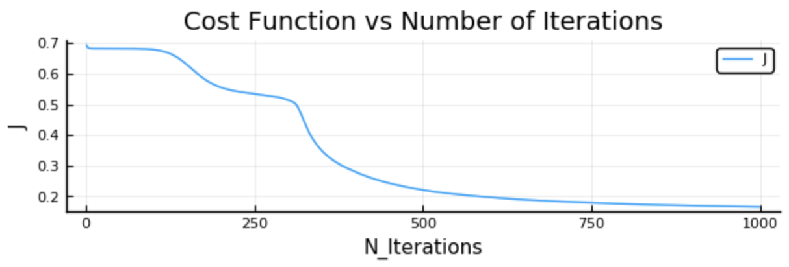
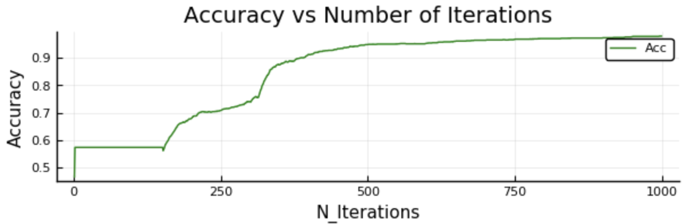

# NeuralNetworks_Julia

Do this in a Jupyter notebook so the graphs will display properly

The main function, train_nn, has the following signature:

```
train_nn(layers_dimensions, activation_functions, X , Y , learning_rate , n_iter, lambda)
```

These inputs are:

* layers_dimensions - the number of layers and neurons in each layer
* activation_functions - the activation function to use for each (non-input) layer
* X - input features, as x<sub>n</sub> x m matrix
* Y - output values, as 1 x m matrix
* learning_rate - $\alpha$
* n_iter - number of iterations to train neural network
* lambda - regularization hyperparameter (ridge regression)

Here is an example of running train_nn on 100 data points. X is two-dimensional and each coordinate is randomly drawn from (-1,1). The outputs are 1 if X lies within a circle. There is a single hidden layer with 3 neurons.

```
layers_dimensions = (2,3,1)
activation_functions = ["relu", "sigmoid"]
s = 2; X = s*rand(2,100).-s/2;
Y = (X[1,:].^2+X[2,:].^2).<0.5
Y=Y'
learning_rate = 1
n_iter = 1000
lambda = 1
params, costs = train_nn(layers_dimensions, activation_functions, X , Y , learning_rate , n_iter, lambda)
```
If you ran this in a Jupyter notebook, you'll see a bunch of lines of cost and accuracy outputs, along with two plots (you may have to scroll down a lot to see them). Accuracy tests whether the NN output is <0.5 or >0.5 and matches the original data.




A few [unfortunate] notes on this [as-of-yet] simple implementation of NN: 

* Sometimes it doesn't converge. I haven't figured out why yet. You want the accuracy to be pretty close to 1. Try running train_nn again, or increase the iterations and/or learning rate.
* It may take a lot of iterations to converge!
* It may require a very high learning rate (such as 1)!
* Experiment with lambda to see which encourages it to converge more reliably.

