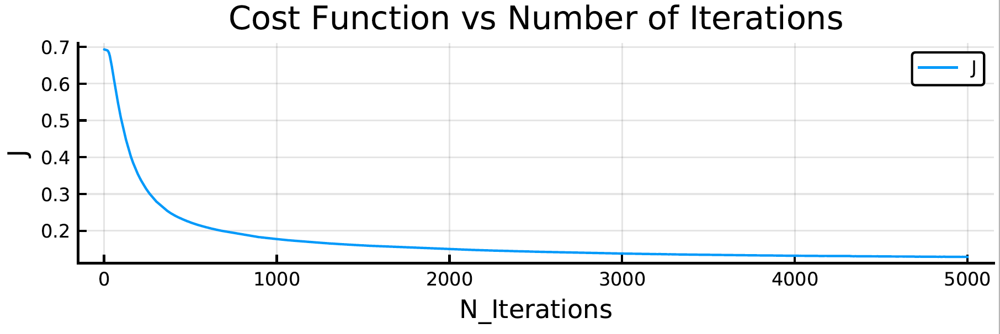
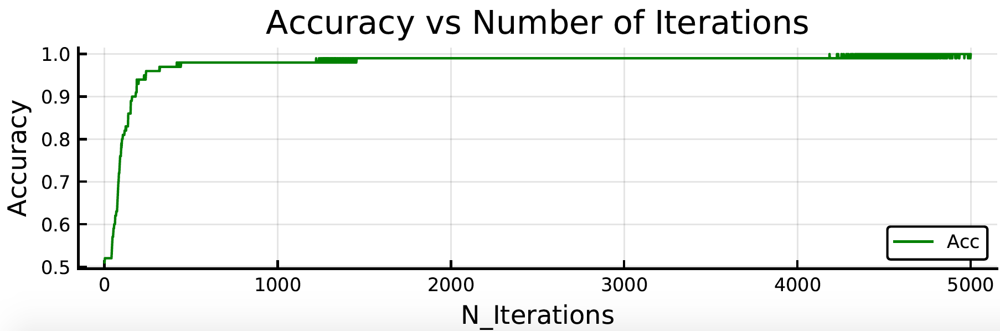

# NeuralNetworks_Julia

These inputs are:

* layers_dimensions - the number of layers and neurons in each layer
* activation_functions - the activation function to use for each (non-input) layer
* X - input features, as x<sub>n</sub> x m matrix
* Y - output values, as 1 x m matrix
* learning_rate - $\alpha$
* n_iter - number of iterations to train neural network
* lambda - regularization hyperparameter (ridge regression)

Here is an example of running train_nn on 100 data points. X is two-dimensional and each coordinate is randomly drawn from (-10, 10). The outputs are 1 if the sum of the absolute values of each coordinate is greater than 10. This will create two triangular regions in the bottom left region and top right region of the graph.  There is a single hidden layer with 6 neurons.

```
layers_dimensions = (2,6,1)
activation_functions = ["relu", "sigmoid"]
X = rand(-10:10, 2, 100)
Y = (abs.(X[1,:])+abs.(X[2,:])).>10
Y=Y'
learning_rate = 0.2
n_iter = 5000
lambda = 1
params, costs = train_nn(layers_dimensions, activation_functions, X , Y , learning_rate , n_iter, lambda)
```





